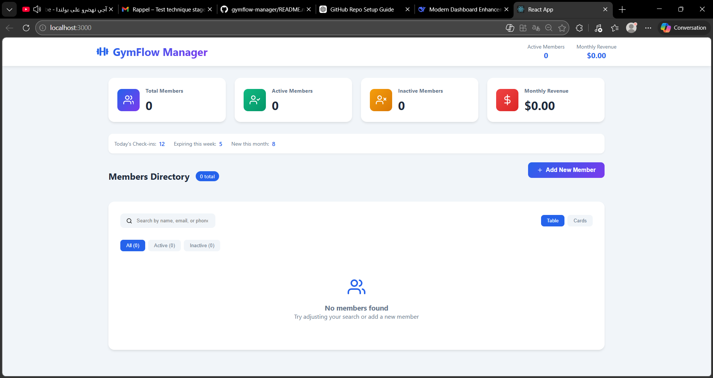

# 🏋️ GymFlow Manager

GymFlow Manager is a modern **React dashboard** that allows gym managers to manage members, track activity, and monitor gym statistics in one place.

The goal of this project is to demonstrate frontend development skills including **React component architecture, state management, and clean UI design**.

---

# 🚀 Live Demo

Coming soon (deployable using Vercel or Netlify)

---

# 📸 Screenshots

## Dashboard Overview

The dashboard provides an overview of gym activity including:

- Active Members
- Inactive Members
- Monthly Revenue
- Total Members

---

## Members Directory

The members directory allows managers to:

- View all gym members
- Check membership status
- View contact information
- Track membership types

---

## Add New Member

The manager can easily add new members using the form by entering:

- Full Name
- Email
- Phone Number
- Membership Type
- Start Date
- Member Status (Active / Inactive)

---

# ✨ Features

- 📊 Dashboard statistics overview
- 👥 Members directory
- ➕ Add new gym members
- 📱 Responsive user interface
- ⚡ Dynamic updates using React state
- 🧩 Modular React components

---

# 🛠 Technologies Used

- React
- JavaScript (ES6)
- HTML5
- CSS3
- React Hooks (`useState`)
- Node.js / npm
